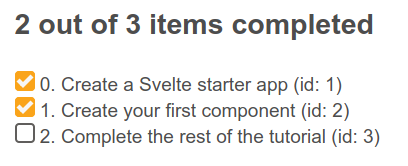

# Adding dynamic behavior: working with variables and props

Now that we have our markup and styles ready we can start developing the required features for our To-Do list app. In this article we'll be using variables and props to make our app dynamic, allowing us to add and delete todos, and mark them as complete. 

> **Prerequisites**: Familiarity with the core HTML, CSS, and JavaScript languages, knowledge of the terminal/command line.
> 
> You'll also need a terminal with node + npm installed to compile and build your app.
>
> **Objective**: Learn and put into practice some basic Svelte concepts, like creating components, passing data using props, render JavaScript expressions into our markup, modify the components state and iterating over lists.

## Coding along with us

If you want to get the app's code to start coding you can clone the github repo (if you haven't already done it) with `git clone https://github.com/opensas/mdn-svelte-tutorial.git` and then `cd mdn-svelte-tutorial/03-adding-dynamic-behavior`, or you may directly download the folder's content with `npx degit opensas/mdn-svelte-tutorial/03-adding-dynamic-behavior`. Remember to run `npm install && npm run dev` to start you app in development mode. You can also follow us online using this [REPL](https://svelte.dev/repl/c862d964d48d473ca63ab91709a0a5a0?version=3.23.2).

## Working with todos

Our `Todos.svelte` component is currently just displaying static markup; let's start making it a bit more dynamic. Let's take the tasks information from the markup and store it in a todos array. We'll also create two variables to keep track of the total number of tasks and the completed tasks.

The state of our component will be represented by these three top-level variables.

Create a `<script>` section at the top of `src/components/Todos.svelte` with the following content:

```html
<script>
  let todos = [
    { id: 1, name: 'Create a Svelte starter app', completed: true },
    { id: 2, name: 'Create your first component', completed: true },
    { id: 3, name: 'Complete the rest of the tutorial', completed: false }
  ]

  let totalTodos = todos.length
  let completedTodos = todos.filter(todo => todo.completed).length
</script>
```

Now let's do something with that information. Let's start by showing a status message. Find the `<h2>` heading with id `list-heading` and replace the hardcoded number of tasks and completed with dynamic expressions:

  ```html
  <h2 id="list-heading">{completedTodos} out of {totalTodos} items completed</h2>
```

Now when you go to the app, you'll see the "2 out of 3 items completed" message as before, but this time the information is coming from the todos array. To prove it, go to that array, and try changing some of the todo object's completed property values, and even add a new todo object. Observe how the numbers in the message are updated appropriately. 

## Dynamically generating the todos from the data

At the moment, our displayed todo items are all static. We want to iterate over each item in our `todos` array and render the markup for each task, so let's do that now.

HTML doesn't have a way of expressing logic, like conditionals and loops. Svelte does. In this case we use the [{#each...}](https://svelte.dev/docs#on_element_event) directive to iterate over the todos array. The second parameter, if provided, will contain the index of the current item. Also, a key expression can be provided, which will uniquely identify each item. Svelte will use it to diff the list when data changes, rather than adding or removing items at the end, and it's a good practice to always specify one. Finally, an `:else` block can be provided, which will be rendered when the list is empty.

Let's give it a try. Replace the existing `<ul>` element with the following simplified version to get an idea of how it works:

```html
<ul>
{#each todos as todo, index (todo.id)}
  <li>
    <input type="checkbox" checked={todo.completed}/> {index}. {todo.name} (id: {todo.id})
  </li>
{:else}
  Nothing to do here!
{/each}
</ul>
```

You'll see something like this:



Now we've seen that this is working, let's generate a complete todo item with each loop of the `{#each}` directive, and inside it embed the information from the `todos` array: _id_, _name_, and _completed_. Replace your existing `<ul>` block with the following:

```html
  <!-- Todos -->
  <ul role="list" class="todo-list stack-large" aria-labelledby="list-heading">
  {#each todos as todo (todo.id)}
    <li class="todo">
      <div class="stack-small">
        <div class="c-cb">
          <input type="checkbox" id="todo-{todo.id}" checked={todo.completed}/>
          <label for="todo-{todo.id}" class="todo-label">
            {todo.name}
          </label>
        </div>
        <div class="btn-group">
          <button type="button" class="btn">
            Edit <span class="visually-hidden">{todo.name}</span>
          </button>
          <button type="button" class="btn btn__danger">
            Delete <span class="visually-hidden">{todo.name}</span>
          </button>
        </div>
      </div>
    </li>
  {:else}
    <li>Nothing to do here!</li>
  {/each}
  </ul>
```

Notice how we are using curly braces to embed JavaScript expressions in HTML attributes, like we did with the _checked_ and _id_ attributes of the checkbox.

We've turned our static markup into a dynamic template ready to display the tasks from our component's state. Great! We are getting there.

## Working with props

With a hardcoded list of todos, our `Todos` component is not very useful. To turn our component into a general purpose To-Do editor we should allow the parent of this component to pass the list of todos to edit. This would allow us to save them to a web service or local storage and later retrieve them for update. So let's turn the array into a prop. In `Todos.svelte` replace `let todos = ...` with `export let todos = []`. 

```html
export let todos = []
```

This may feel a little weird at first. That's not how export normally works in JavaScript modules! This is how Svelte 'extends' JavaScript by taking valid syntax and giving it a new purpose. In this case  Svelte is using the `export` keyword to [mark a variable declaration as a _property_](https://svelte.dev/docs#1_export_creates_a_component_prop) or _prop_, which means it becomes accessible to consumers of the component.

You can also specify a default initial value for a prop. It will be used if the component's consumer doesn't specify the prop on the component (or if its initial value is undefined) when instantiating the component. 

So with `export let todos = []`, we are telling Svelte that our `Todos.svelte` component will accept a `todos` attribute, that when omitted will be initialized to an empty array.

If you have a look at the app you'll see the `Nothing to do here!` message. This is because we are not passing any value into it from `App.svelte`, so its using the default value.

Now let's move our todos to `App.svelte` and pass them to `Todos.svelte` component as a prop. Update src/App.svelte as follows:

```html
<script>
  import Todos from './components/Todos.svelte'

  let todos = [
    { id: 1, name: 'Create a Svelte starter app', completed: true },
    { id: 2, name: 'Create your first component', completed: true },
    { id: 3, name: 'Complete the rest of the tutorial', completed: false }
  ]
</script>

<Todos todos={todos} />
```

A nice shortcut provided by Svelte is that when the attribute and the variable has the same name you can just specify the variable, so we can rewrite our last line like this:

```html
<Todos {todos} />
```

At this point your todos should render just like they did before, except that now we're passing them in from the App.svelte component. 

## Toggling and removing todos

Let's add some functionality to toggle the task status. Svelte has the [on:eventname](https://svelte.dev/docs#on_element_event) directive to listen to DOM events. Let's add a handler to the `on:click` event of the checkbox input to toggle the completed value. Update the `<input type="checkbox">` element inside src/components/Todos.svelte as follows:

```html
<input type="checkbox" id="todo-{todo.id}" 
  on:click={() => todo.completed = !todo.completed}
  checked={todo.completed}
/>
```

Next then we'll add a function to remove a todo from our todos array. At the bottom of the Todos.svelte `<script>` section, add the `removeTodo()` function like so:

```javascript
  function removeTodo(todo) {
    todos = todos.filter(t => t.id !== todo.id)
  }
```

And we'll call it from the _Delete_ button. Update it with a click event, like so:

```html
<button type="button" class="btn btn__danger"
  on:click={() => removeTodo(todo)}
>
  Delete <span class="visually-hidden">{todo.name}</span>
</button>
```

A very common mistake with handlers in Svelte is to pass the result of executing a function as a handler, instead of passing the function. For example, if you specify `on:click={removeTodo(todo)}`, it will execute `removeTodo(todo)` and the result will be passed as a handler, which is not what we had in mind. 

In this case you have to specify `on:click={() => removeTodo(todo)}` as handler. If `removeTodo` received no params, you could use `on:event={removeTodo}`, but not `on:event={removeTodo()}`. This is not some special Svelte syntax — here we are just using regular [JavaScript arrow functions](https://developer.mozilla.org/en-US/docs/Web/JavaScript/Reference/Functions/Arrow_functions). 

Again, this is good progress — at this point, we can now delete tasks. When a "Delete" button is pressed, the relevant todo is removed from the todos array, and the UI updates to no longer show it. In addition, we can now check the checkboxes, and the completed status of the relevant todos will now update in the todos array. But the "x out of y items completed" heading is not being updated. Read on to find out why this is happening and how we can solve it.

## Reactive todos

As we've already seen, every time the value of a component's top-level variable is modified Svelte knows how to update the UI. In our case, if the `todos`, `totalTodos` or `completedTodos` if updated Svelte will update the DOM. But in this case the following code is just two regular javascript assignments that, like the rest of the `<script>` tag, gets executed when the component is instantiated:

```javascript
  let totalTodos = todos.length
  let completedTodos = todos.filter(todo => todo.completed).length
```

We could recalculate them after toggling and removing todos, but there's an easier way to do it.

We can tell Svelte that our `totalTodos` and `completedTodos` variables are _reactive_ by prefixing them with `$:`. Svelte will generate the code to automatically update them whenever data they depend on is changed.

> Svelte uses the `$:` [JavaScript label statement](https://developer.mozilla.org/en-US/docs/Web/JavaScript/Reference/Statements/label) syntax to mark reactive statement. Just like the `export` keyword being used to declare props, this may look a little alien. This is another example in which Svelte takes advantage of valid JavaScript syntax and gives it a new purpose — in this case to to mean 're-run this code whenever any of the referenced values change'. Once you get used to it, there's no going back.

Update your `totalTodos` and `completedTodos` variable definitions inside src/components/Todos.svelte to look like so:

```javascript
  $: totalTodos = todos.length
  $: completedTodos = todos.filter(todo => todo.completed).length
```

If you check your app now, you'll see that the heading's numbers are updated when todos are completed or deleted. Nice!

Behind the scenes Svelte compiler will parse and analyze our code to make a dependency tree, then it will generate the JavaScript code to re-evaluate each reactive statement whenever one of their dependencies is updated. Reactivity in Svelte is implemented in a very lightweight and performant way, without using listeners, setters, getters, or any other complex mechanism.

# Adding new todos

Now onto the final task for this article — let's add some functionality for adding new todos.

First, we'll create a variable to hold the text of the new todo. Add this declaration to the `<script>` section of `Todos.svelte` file:

```javascript
  let newTodoName = ''
```

Now we have to use this value in the `<input>` for adding new tasks. To do that we need to _bind_ our `newTodoName` variable to the `todo-0` input, so that the `newTodoName` variable value stays in sync with the input's value property. We could do something like this:

```javascript
<input value={newTodoName} on:keydown={(e) => newTodoName = e.target.value} />
```

Whenever the value of the variable `newTodoName` changes, it will be reflected in the `value` attribute of the input, and whenever a key is pressed in the input, we will update the contents of the variable `newTodoName`.

This is a manual implementation of two-way data binding for an input box. But Svelte provides an easier way to bind any property to a variable — using the [bind:property](https://svelte.dev/docs#bind_element_property) directive, like this:

```html
<input bind:value={newTodoName} />
```

So, let's implement this. Update the `todo-0` input like so:

```html
<input bind:value={newTodoName} type="text" id="todo-0" autocomplete="off" class="input input__lg" />
```

An easy way to test that this works is to add a reactive statement to log the contents of `newTodoName`. Add this snippet at the end of the `<script>` section:

```javascript
$: console.log('newTodoName: ', newTodoName)
```

> Note: as you may have noticed, reactive statements aren't limited to variable declarations. You can put any JavaScript expression after the `$:` sign.

Now try going back to [localhost:5000](http://localhost:5000/), press `Ctrl-Shift-K` to open your browser console and start typing something in the input box. You should see your entries logged. At this point, you can delete the reactive console.log if you wish.

Now we'll create a function to add the new todo — addTodo(), which will push a new todo object onto the todos array. Add this to the bottom of your `<script>` block inside src/components/Todo.svelte:

```javascript
function addTodo() {
  todos.push({ id: 999, name: newTodoName, completed: false })
  newTodoName = ''
}
```

Note: For the moment we are just assigning the same id to every todo, but don't worry, we will fix that in a minute.

Now we want to update our HTML so that we call addTodo() once the form is submitted. Update the NewTodo form's opening tag like so:

```html
  <form on:submit|preventDefault={addTodo}>
```

Note: The [on:eventname](https://svelte.dev/docs#on_element_event) directive supports adding modifiers to the DOM event with the `|` character. In this case, the `preventDefault` modifier tells Svelte to generate the code to call event.preventDefault() before running the handler. Explore the previous link to see what other modifiers are available.

If you try adding new todos in our app at this point, the new todos are added to the `todos` array but our UI is not updated. That's because in Svelte reactivity is [triggered with assignments](https://svelte.dev/docs#2_Assignments_are_reactive). That means that the `addTodo()` function is executed, the element is added to the `todos` array, but Svelte won't detect that the `push` method modified the array, so it won't refresh the tasks `<ul>`.

Just adding `todos = todos` at the end of the `addTodo` function would solve the problem, but it seems strange to have to include that at the end of the function. Instead, we'll take out the push() method and use [spread syntax](https://developer.mozilla.org/en-US/docs/Web/JavaScript/Reference/Operators/Spread_syntax) to achieve the same result, except that this time we're assigning a value to the todos array equal to the todos array plus the new object. 

> Array has several mutable operations - `push`, `pop`, `splice`, `shift`, `unshift`, `reverse` and `sort`. Using them is usually causing side effects and bugs that are hard to track. By using the spread syntax instead of `push` we avoid mutating the array, which is considered a good practice. 

Update your addTodo() function like so:

```javascript
function addTodo() {
  todos = [...todos, { id: 999, name: newTodoName, completed: false }]
  newTodoName = ''
}
```

## Giving each todo a unique ID

If you try to add new todos in your app now, you'll be able to add a new todo and have it appear in the UI! Once. If you try it a second time, it won't work, and you'll get a console message saying "Error: Cannot have duplicate keys in a keyed each". We need unique IDs for our todos!

Let's declare a `newTodoId` variable calculated from the number of todos plus 1, and make it reactive. Add the following snippet to the `<script>` section:

```javascript
  let newTodoId
  $: {
    if (totalTodos === 0) {
      newTodoId = 1;
    } else {
      newTodoId = Math.max(...todos.map(t => t.id)) + 1;
    }
  }
```

Note: as you can see, reactive statements are not limited to one-liners. The following would work too, but it is a little less readable: `$: newTodoId = totalTodos ? Math.max(...todos.map(t => t.id)) + 1 : 1` 

How does Svelte achieve this? The compiler parses the whole reactive statement, and detects that it depends on the `totalTodos` variable and `todos` array. So whenever either of them is modified, this code is re-evaluated, updating `newTodoId` accordingly.

Let's use it in our `addTodo()` function — update it like so:

```javascript
  function addTodo() {
    todos = [...todos, { id: newTodoId, name: newTodoName, completed: false }]
    newTodoName = ''
  }
```

## Filtering todos by status

Let's implement filtering our todos by status. We'll create a variable to hold the current filter, and a helper function that will return the filtered todos.

At the bottom of our `<script>` section add:

```javascript
  let filter = 'all'
  const filterTodos = (filter, todos) => 
    filter === 'active' ? todos.filter(t => !t.completed) :
    filter === 'completed' ? todos.filter(t => t.completed) : 
    todos
```
We use the `filter` variable to control the active filter: _all_, _active_ or _completed_. Just assigning one of these values to the `filter` variable will activate the filter and update the list of todos. Let's see how to achieve this.

The `filterTodos` function will receive the current filter and the list of todos, and it will return a new array of todos filtered accordingly.

Let's now update the markup to make it dynamic and to update the current filter when the user presses any button.

```html
<div class="filters btn-group stack-exception">
  <button class="btn toggle-btn" class:btn__primary={filter === 'all'} aria-pressed={filter === 'all'} on:click={()=> filter = 'all'} >
    <span class="visually-hidden">Show</span>
    <span>All</span>
    <span class="visually-hidden">tasks</span>
  </button>
  <button class="btn toggle-btn" class:btn__primary={filter === 'active'} aria-pressed={filter === 'active'} on:click={()=> filter = 'active'} >
    <span class="visually-hidden">Show</span>
    <span>Active</span>
    <span class="visually-hidden">tasks</span>
  </button>
  <button class="btn toggle-btn" class:btn__primary={filter === 'completed'} aria-pressed={filter === 'completed'} on:click={()=> filter = 'completed'} >
    <span class="visually-hidden">Show</span>    
    <span>Completed</span>
    <span class="visually-hidden">tasks</span>
  </button>
</div>
```

There are a couple of things going on in this markup.

We will show the current filter by applying the `btn__primary` to the button of that filter. To conditionally apply style classes to an element we use the [class:name={value}](https://svelte.dev/docs#class_name) directive. If the `value` expression evaluates to [truthy](https://developer.mozilla.org/en-US/docs/Glossary/Truthy) the class `name` will be applied. You can add many of this directives, with different conditions, to the same element. So when we issue `class:btn__primary={filter === 'all'}` Svelte will apply the `btn__primary` class if `filter` equals `all`.

> As you may have guessed by now, Svelte provides a shortcut which allows to write `<div class:active={active}>` like `<div class:active>` when the class matches the variable name.

Something similar happens with the `aria-pressed={filter === 'all'}`, when the JavaScript expression passed between curly braces evaluates to a truthy value, the `aria-pressed` attribute will be added to the button.

Whenever we click on a button we update the `filter` variable by issuing `on:click={()=> filter = 'all'}`. Read on to find out how Svelte reactivity will take care of the rest.

Now we just need to use the helper function in the `{#each}` loop:

```html
[...]
  <ul role="list" class="todo-list stack-large" aria-labelledby="list-heading">
  {#each filterTodos(filter, todos) as todo (todo.id)}
[...]
```

After analyzing our code Svelte will find out that our `filterTodos` function depends on the variables `filter` and `todos`. And just like with any other dynamic expression embedded in the markup, whenever any of these dependencies change the DOM will be updated accordingly. So whenever `filter` or `todos` changes, the `filterTodos` function will be re-evaluated and the items inside the loop will be updated.

> Tip: reactivity can be tricky sometimes. Svelte recognizes the `filter` as a dependency because where are referencing it in the `filterTodos(filter, todo)` expression. `filter` is a top-level variable, so we might be tempted to remove it from the helper function params, and just call it like this `filterTodos(todo)`. This would work, but now Svelte has no way to find out that `{#each filterTodos(todos)...` depends on `filter`, and the list of filtered todos won't be updated when the `filter` changes. Always remember that Svelte analyzes our code to find out dependencies, so it's better to be explicit about it and don't rely on the visibility of top-level variables. Besides it's a good practice to make our code clear and explicit about what information is using.

## Coding along with us

If you want to see how the app's code should look like by now you can clone the github repo (if you haven't already done it) with `git clone https://github.com/opensas/mdn-svelte-tutorial.git` and then `cd mdn-svelte-tutorial/04-componentizing-our-app`, or you may directly download the folder's content with `npx degit opensas/mdn-svelte-tutorial/04-componentizing-our-app`. Remember to run `npm install && npm run dev` to start you app in development mode. You can also follow us online using this [REPL](https://svelte.dev/repl/99b9eb228b404a2f8c8959b22c0a40d3?version=3.23.2).

## Summary

That will do for now! In this article we already implemented most of the desired functionality. Our app can display, add and delete todos, toggle their completed status, show how many of them are completed and also apply filters to our todos.

To recap, we covered the following topics:

- Creating and using components.
- Turning static markup into a live template.
- Embedding JavaScript expressions in our markup.
- Iterating over lists using the `{#each}` directive.
- Passing information between components with props.
- Listening to DOM events.
- Declaring reactive statements.
- Basic debugging with console.log() and reactive statements.
- Binding HTML properties with the `bind:property` directive.
- Triggering reactivity with assignments.
- Use reactive expressions to filter data
- Explicitly define our reactive dependencies

In the next article we will add further functionality to allow users to edit todos and filter them by status.
