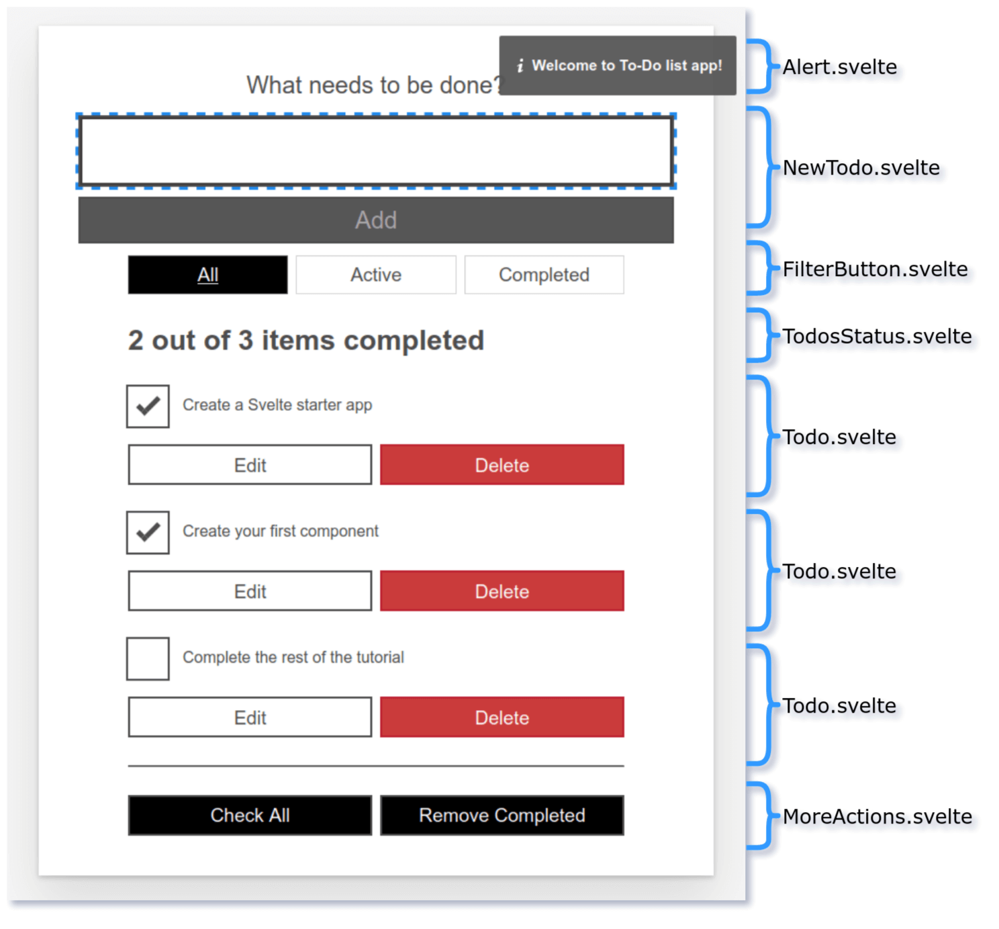

# Componentizing our Svelte app

In the last article we started developing our Todo list app. Now it's time to go further and add more features to our app, but the central objective here is to look at how to break our app into manageable components and share information between them.

In Svelte, an application is composed from one or more components. A component is a reusable self-contained block of code that encapsulates HTML, CSS and JavaScript that belong together, written into a .svelte file. Components can be big or small, but they are usually clearly defined: they serve a single, obvious purpose.

The benefits of defining components are akin to the benefits or organizing your code into manageable pieces. It will help you understand how they relate with each other, it will promote reuse, and it will make your code easier to reason about, maintain and extend. Same principles apply to UI components.

But how do you know what should be its own component? 

There are no hard rules for this. Some people prefer an intuitive approach and start looking at the markup and drawing boxes around every component and subcomponent that seems to have its own logic.

Other people apply the same techniques used for deciding if you should create a new function or object. One such technique is the single responsibility principle, that is, a component should ideally only do one thing. If it ends up growing, it should be decomposed into smaller subcomponents.

Both approaches should complement each other, and help you decide how to better organize your components.

We will split up our app in the following components:



Right now, we will start with these two:

- FilterButton: Displays the buttons for filtering todos based on its status and updates the current filter.

- Todo: Displays a todo, and allows the user to modify and delete it, emitting the corresponding events. 

In the next articles we will continue componentizing the rest of the application.

> **Prerequisites**: Familiarity with the core HTML, CSS, and JavaScript languages, knowledge of the terminal/command line.
> 
> **Objective**: 	To learn how to break our app into components and share information among them.

## Coding along with us

If you want to get the app's code to start coding you can clone the github repo (if you haven't already done it) with `git clone https://github.com/opensas/mdn-svelte-tutorial.git` and then `cd mdn-svelte-tutorial/04-componentizing-our-app`, or you may directly download the folder's content with `npx degit opensas/mdn-svelte-tutorial/04-componentizing-our-app`. Remember to run `npm install && npm run dev` to start you app in development mode. You can also follow us online using this [REPL](https://svelte.dev/repl/99b9eb228b404a2f8c8959b22c0a40d3?version=3.23.2).

## Componentizing our app

Let's start breaking apart our app into components. We will also learn different techniques to communicate between components, and the pros and cons of each approach.

We'll start extracting the filter functionality to its own component.

First of all, create a new file — `components/FilterButton.svelte`. 

Inside this file we will declare a `filter` prop, and then copy the relevant markup over to it from Todos.svelte. Add the following into the file:

```html
<script>
  export let filter = 'all'
</script>

<div class="filters btn-group stack-exception">
  <button class="btn toggle-btn" class:btn__primary={filter === 'all'} aria-pressed={filter === 'all'} on:click={()=> filter = 'all'} >
    <span class="visually-hidden">Show</span>
    <span>All</span>
    <span class="visually-hidden">tasks</span>
  </button>
  <button class="btn toggle-btn" class:btn__primary={filter === 'active'} aria-pressed={filter === 'active'} on:click={()=> filter = 'active'} >
    <span class="visually-hidden">Show</span>
    <span>Active</span>
    <span class="visually-hidden">tasks</span>
  </button>
  <button class="btn toggle-btn" class:btn__primary={filter === 'completed'} aria-pressed={filter === 'completed'} on:click={()=> filter = 'completed'} >
    <span class="visually-hidden">Show</span>
    <span>Completed</span>
    <span class="visually-hidden">tasks</span>
  </button>
</div>
```

Back in our `Todos.svelte` component, we want to make use of our FilterButton component. First of all, we need to import it — add the following line at the top of the Todos.svelte `<script>` section 

```javascript
  import FilterButton from './FilterButton.svelte'
```

Now, replace the filters `<div>` with a call to the `FilterButton` component, which takes the current filter as a prop — the below line is all you need:

```html
  <FilterButton {filter} />
```

> Note: Remember that when the HTML attribute name and variable matches, they can be replaced with `{variable}`, that's why we could replace `<FilterButton filter={filter} />` with `<FilterButton {filter} />`.

So far so good! Let's try out the app now. You'll notice that when you click on the filter buttons, they are selected and the style updates appropriately, but we have a problem — the todos aren't filtered. That's because the `filter` variable flows down from `Todos` component to `FilterButton` component through the prop, but changes occurring in the `FilterButton` component don't flow back up to its parent — the data binding is one-way by default. We will see different approaches to let child components communicate with their parent.

## Sharing data between components: passing a handler as a prop

One way to let child components notify its parent of any change, is to pass a handler as a prop. The child component will execute the handler, passing the needed information as a parameter, and the handler will modify the parents state.

In our case, our `FilterButton` component will receive an `onclick` handler from its parent. Whenever the user clicks on any filter button the child will call the `onclick` handler passing the selected filter as a parameter.

We will just declare the `onclick` prop assigning a dummy handler to prevent errors, like this: 

```javascript
export let onclick = (clicked) => {}
```

And we'll declare the following reactive statement `$: onclick(filter)` to call the `onclick` handler whenever the `filter` variable is updated.

The `<script>` section of our `FilterButton` will end up like this:

```html
<!-- components/FilterButton.svelte -->
<script>
  export let filter = 'all'
  export let onclick = (clicked) => {}
  $: onclick(filter)
</script>
```

Now when we call `FilterButton` from `Todos.svelte` we specify the handler, like this:

```html
  <FilterButton {filter} onclick={ (clicked) => filter = clicked }/>
```

When any filter button is clicked, we just update the `filter` variable with the new filter. Now our `FilterButton` component works ok.

## Sharing data between components: two way data binding with bind directive

In the previous example we realized that our `FilterButton` component wasn't working because our application state was flowing down, from parent to child, thru the filter prop but it wasn't going up. So we added an `onclick` prop to let the child component notify the new filter to its parent.

It works ok, but Svelte provides us an easier and more straightforward way to achieve two way data binding. Data ordinarily flows down from parent to child using props. If we want it to also flow the other way — from child to parent — we can use the [bind: directive](https://svelte.dev/docs#bind_element_property). 

Using `bind`, we will tell Svelte that any changes made to the `filter` prop in the `FilterButton` component should propagate back up to the parent component, `Todos`. That is, we will bind the variable `filter` in the parent with the variable `filter` in the child.

In `Todos.svelte`, update the call to the FilterButton component as follows:

```html
<FilterButton bind:filter={filter} />
```

As usual, Svelte provides us with a nice shorthand — `bind:value={value}` is the same as `bind:value`. So in the above example you could just write `<FilterButton bind:filter />`

The child component can now modify the value of the parent's filter variable, so we no longer need the `onclick` prop. We can now modify our `FilterButton` like this:

```html
<!-- components/FilterButton.svelte -->
<script>
  export let filter = 'all'
</script>
```

If you try your app again, you should now see that the list of todos now filters correctly when you press the filter buttons.

## Creating our Todo component

Now we will create a `Todo` component to encapsulate each individual todo, including the checkbox and editing logic.

Our `Todo` component will receive a single `todo` object as a prop. Let's declare the _todo_ prop and move the code from the `Todos` component. Just for now, we'll also replace the call to `removeTodo` with an alert. We'll add that functionality back later.

Create a new component file — `components/Todo.svelte`.

Put the following contents inside this file:

```html
<script>
  export let todo
</script>

<div class="stack-small">
  <div class="c-cb">
    <input type="checkbox" id="todo-{todo.id}" 
      on:click={() => todo.completed = !todo.completed}
      checked={todo.completed}
    />
    <label for="todo-{todo.id}" class="todo-label">{todo.name}</label>
  </div>
  <div class="btn-group">
    <button type="button" class="btn">
      Edit <span class="visually-hidden">{todo.name}</span>
    </button>
    <button type="button" class="btn btn__danger" on:click={() => alert('not implemented')}>
      Delete <span class="visually-hidden">{todo.name}</span>
    </button>
  </div>
</div>
```

Now we need to import our `Todo` component into Todos.svelte. Add the following `import` statement below your previous one inside Todos.svelte:

```javascript
  import Todo from './Todo.svelte'
```

Then we need to update our `{#each}` block to include a `<Todo>` component for each `todo`, rather than the code that is now contained inside `Todo.svelte` We are also passing the current `todo` object into the component as a prop. 

Update your `{#each}` block inside `Todos.svelte` like so:

```html
  <ul role="list" class="todo-list stack-large" aria-labelledby="list-heading">
  {#each filterTodos(filter, todos) as todo (todo.id)}
    <li class="todo">
      <Todo {todo} />
    </li>
  {:else}
    <li>Nothing to do here!</li>
  {/each}
  </ul>
```

The list of todos is displayed on the page, and the checkbox seem to work, but our 'x out of y items completed' message will not update accordingly. That's because our `Todo` component is receiving the `todo` via the prop, but it's not sending any information back to its parent. Read on to find out another way to to let our `Todo` child component communicate with its parent.

## Sharing data between components: props-down, events-up pattern 

The `bind` directive is pretty straightforward and allows you to share data between a parent and child component with minimal fuss. But when your application grows larger and more complex it can easily get difficult to keep track of all your bound values. A different approach is the "props-down" and "events-up" communication pattern. 

Basically this pattern relies on child components receiving data from their parents via props and parent components updating their state by handling events emitted from child components. So _props flow down_ from parent to child and _events bubble up_ from child to parent. This pattern establishes a one way flow of information from parent to child, which makes the data flow predictable and easier to reason about.

Let's look at how to emit our own events to implement the _Delete_ button functionality.

To create custom events we'll use the `createEventDispatcher` utility. This will return a `dispatch()` function that will allow us to emit custom events. When you dispatch an event you have to pass the name of the event and, optionally, an object with additional information that you want to pass to every listener. This additional data will be available on the _detail_ property of the event object.

> Note: Custom events in Svelte share the same API as regular DOM events. Moreover, you can bubble up an event to your parent component by specifying `on:event` without any handler.

We'll edit our `Todo` component to emit a `remove` event, passing the todo being removed as additional information.

First of all, add the following lines to the top of the Todo component `<script>` section:

```javascript
  import { createEventDispatcher } from 'svelte'
  const dispatch = createEventDispatcher()
```

Now update the delete button in the markup section of the same file to look like so:

```html
  <button type="button" class="btn btn__danger" on:click={() => dispatch('remove', todo)}>
    Delete <span class="visually-hidden">{todo.name}</span>
  </button>
```

With `dispatch('remove', todo)` we are emitting the `remove` event, and passing as additional data the _todo_ being deleted. The handler will be called with an `event` parameter with the additional data in the `event.detail` property.

Now we have to listen to that event from inside `Todos.svelte` and act accordingly. Go back to this file, and update your `<Todo>` component call like so:

```html
  <Todo {todo} on:remove={e => removeTodo(e.detail)}/>
```

Our handler receives the `e` parameter (the event) which holds the `todo` being deleted in the `detail` property.

At this point, if you try out your app again, you should see that the _Delete_ functionality now works again! So our custom event has worked as we hoped.

Now we'll take care of the `update` event, so that our parent component can get notified of any modified `todo`.

# Updating todos

We still have to implement functionality to allow us to edit existing `todos`. We'll have to handle an `editing` mode. When entering `editing` mode we'll show an `<input>` field to allow us to edit the current todo name, with two buttons to confirm or cancel our changes. So we'll need a variable to track whether we are in `editing` mode and another one to store the name of the task being updated.

Add the following variable definitions into the top of the `<script>` section of Todo component:

```javascript
  let editing = false                     // track editing mode
  let name = todo.name                    // hold the name of the todo being edited
```

We have to decide what events our `Todo` component will emit:

* We could emit different events for the status toggle and editing of the name. (e.g. _updateTodoStatus_ and _updateTodoName_) 
* Or we could take a more generic approach and emit a single `update` event for both operations.

We will take the second approach so we can demonstrate a different technique. The advantage of this approach is that later we can add more fields to the todos without having to handle new events.

Let's create an `update()` function that will receive the changes and will emit an `update` event with the modified `todo`. Add the following, again to the bottom of the `<script>` section:

```javascript
  function update(updatedTodo) {
    todo = { ...todo, ...updatedTodo }    // applies modifications to todo
    dispatch('update', todo)              // emit update event
  }
```

We are using the [spread syntax](https://developer.mozilla.org/en-US/docs/Web/JavaScript/Reference/Operators/Spread_syntax) to return the original `todo` with the modifications applied to it.

Next we'll create different functions to handle each user action. When the `Todo` is on editing mode, the user can save or cancel the changes. When it's not in editing mode, the user can delete the todo, edit it, or toggle its status between completed and active. Add the following set of functions below your previous function:

```javascript
  function onCancel() {
    name = todo.name                      // restores name to its initial value and
    editing = false                       // and exit editing mode
  }

  function onSave() {
    update({ name: name })                // updates todo name
    editing = false                       // and exit editing mode
  }

  function onRemove() {
    dispatch('remove', todo)              // emit remove event
  }

  function onEdit() {
    editing = true                        // enter editing mode
  }

  function onToggle() {
    update({ completed: !todo.completed}) // updates todo status
  }
```

Finally, we need to update our todo markup to call the above functions when the appropriate actions are taken.

To handle the the `editing` mode we are using the `editing` variable, which is a boolean. When it's true, it should display the input box to edit the todos name, and two buttons to Cancel or Save changes. When it's not in `editing` mode it will display the checkbox, the todo name and the buttons to edit and delete the todo.

To achieve it we will use the [`if`](https://svelte.dev/docs#if) block. The `if` block conditionally renders some markup. Take into account that it won't just show or hide the markup based on the condition, it will dynamically add and remove the elements from the DOM depending on the condition. When `editing` is true, Svelte will show the update form, when it's false, it will remove it from the DOM and add the checkbox instead. Thanks to Svelte reactivity, assigning the value of the `editing` variable will be enough to display the correct HTML elements.

```html
<div class="stack-small">
{#if editing}
  <!-- markup for editing todo: label, input text, Cancel and Save Button -->
{:else}
  <!-- markup for displaying todo: checkbox, label, Edit and Delete Button -->
{/if}
</div>
```

The non-editing section, that is the `{:else}` part of the `if` block, will be very similar to the one we had in our `Todos` component, the only difference is that we are calling `onToggle`, `onEdit` and `onRemove` depending on the user action.

```html
{:else}
  <div class="c-cb">
    <input type="checkbox" id="todo-{todo.id}"
      on:click={onToggle} checked={todo.completed}
    >
    <label for="todo-{todo.id}" class="todo-label">{todo.name}</label>
  </div>
  <div class="btn-group">
    <button type="button" class="btn" on:click={onEdit}>
      Edit<span class="visually-hidden"> {todo.name}</span>
    </button>
    <button type="button" class="btn btn__danger" on:click={onRemove}>
      Delete<span class="visually-hidden"> {todo.name}</span>
    </button>
  </div>
{/if}
</div>
```

As you can see below, when the user pressed the `Edit` button, we execute `onEdit()`, which just assigns _true_ to the `editing` variable. When the user clicks on the checkbox, we call the `onToggle()` function, which just executes `update()` passing an object with the new _completed_ value as parameter. The `update()` function emits the `update` event passing as additional information a copy of the original `todo` with the changes applied. Finally, the `onRemove()` function emits the `remove` event passing the `todo` to be deleted as additional data.

The `editing` part of the markup will contain an input box and two buttons to cancel or save the changes:

```html
<div class="stack-small">
{#if editing}
  <form on:submit|preventDefault={onSave} class="stack-small" on:keydown={e => e.key === 'Escape' && onCancel()}>
    <div class="form-group">
      <label for="todo-{todo.id}" class="todo-label">New name for '{todo.name}'</label>
      <input bind:value={name} type="text" id="todo-{todo.id}" autoComplete="off" class="todo-text" />
    </div>
    <div class="btn-group">
      <button class="btn todo-cancel" on:click={onCancel} type="button">
        Cancel<span class="visually-hidden">renaming {todo.name}</span>
        </button>
      <button class="btn btn__primary todo-edit" type="submit" disabled={!name}>
        Save<span class="visually-hidden">new name for {todo.name}</span>
      </button>
    </div>
  </form>
{:else}
[...]
```

When the user presses the Edit button, `editing` variable will be set to true, and svelte will remove the markup in the `{:else}` part of the DOM and replace it with the markup in the `{#if...}` section.

The input box value property will be bound to the `name` variable, and the buttons to cancel and save the changes call `onCancel()` and `onSave()` respectively.

We also disable the save button when the input is empty with the `disabled={!name}` attribute, and take care of the _escape_ key to cancel the edition like this: `on:keydown={e => e.key === 'Escape' && onCancel()}`.

And again we have a function for each action:

```javascript
  function onCancel() {
    name = todo.name                      // restores name to its initial value and
    editing = false                       // and exit editing mode
  }

  function onSave() {
    update({ name: name })                // updates todo name
    editing = false                       // and exit editing mode
  }
```

If the user presses the Cancel button, we restore the value of `name` to the original value of the `todo` passed as prop and exit `editing` mode. If the user presses Save, we run the `update()` function with the modified name and also exit `editing` mode.

We also use `todo.id` to create unique ids for the input controls and labels.

This the complete markup of our `Todo` component:

```html
<div class="stack-small">
{#if editing}
  <!-- markup for editing todo: label, input text, Cancel and Save Button -->
  <form on:submit|preventDefault={onSave} class="stack-small" on:keydown={e => e.key === 'Escape' && onCancel()}>
    <div class="form-group">
      <label for="todo-{todo.id}" class="todo-label">New name for '{todo.name}'</label>
      <input bind:value={name} type="text" id="todo-{todo.id}" autoComplete="off" class="todo-text" />
    </div>
    <div class="btn-group">
      <button class="btn todo-cancel" on:click={onCancel} type="button">
        Cancel<span class="visually-hidden">renaming {todo.name}</span>
        </button>
      <button class="btn btn__primary todo-edit" type="submit" disabled={!name}>
        Save<span class="visually-hidden">new name for {todo.name}</span>
      </button>
    </div>
  </form>
{:else}
  <!-- markup for displaying todo: checkbox, label, Edit and Delete Button -->
  <div class="c-cb">
    <input type="checkbox" id="todo-{todo.id}"
      on:click={onToggle} checked={todo.completed}
    >
    <label for="todo-{todo.id}" class="todo-label">{todo.name}</label>
  </div>
  <div class="btn-group">
    <button type="button" class="btn" on:click={onEdit}>
      Edit<span class="visually-hidden"> {todo.name}</span>
    </button>
    <button type="button" class="btn btn__danger" on:click={onRemove}>
      Delete<span class="visually-hidden"> {todo.name}</span>
    </button>
  </div>
{/if}
</div>
```

> We could further split this into two different components, one for editing the todo and the other for displaying ti. In the end, it boils down to how comfortable you feel dealing with this level of complexity in a single component. You should also take into account if splitting it up enables reusing this component in a different context. 

Now we have to handle the `update` event from the `Todos` component. In the `<script>` section add this handler:

```javascript
  function updateTodo(todo) {
    const i = todos.findIndex(t => t.id === todo.id)
    todos[i] = { ...todos[i], ...todo }
  }
```

We find the `todo` by _id_ in our `todos` array, and update its content using spread syntax. In this case we could have also just use `todos[i] = todo`, but this implementation is more bullet-proof, allowing the `Todo` component to return only the updated parts of the todo.

Next we have to listen for the update event on our `<Todo>` component call, and run our `updateTodo()` function when this occurs to change the name and completed status:

Update your <Todo> call like this:

```html
    {#each filterTodos(filter, todos) as todo (todo.id)}
      <Todo {todo}
        on:update={e => updateTodo(e.detail)}
        on:remove={e => removeTodo(e.detail)}
      />
```

Try your app again, and you should see that you can delete, add, edit, cancel editing of, and toggle completion status of, your todos!

As you can see it's easy to implement the props-down events-up pattern in Svelte. Nevertheless, for simple components `bind` can be a good choice; Svelte will let you choose.

> Note: Svelte provides more advanced mechanisms to share information among components: the [context api](https://svelte.dev/docs#setContext) and [stores](https://svelte.dev/docs#svelte_store). The context API provides a mechanism for a components and its descendants to 'talk' to each other without passing around data and functions as props, or dispatching lots of events. And stores allows you to share reactive data among components that are not hierarchically related. We will see later an example of stores.

## Coding along with us

If you want to see how the app's code should look like by now you can clone the github repo (if you haven't already done it) with `git clone https://github.com/opensas/mdn-svelte-tutorial.git` and then `cd mdn-svelte-tutorial/05-advanced-concepts`, or you may directly download the folder's content with `npx degit opensas/mdn-svelte-tutorial/05-advanced-concepts`. Remember to run `npm install && npm run dev` to start you app in development mode. You can also follow us online using this [REPL](https://svelte.dev/repl/76cc90c43a37452e8c7f70521f88b698?version=3.23.2).

## Summary

Now we have all of our app's required functionality in place. We can display, add, edit and delete todos, mark them as completed, and filter by status.

In this section, we covered the following topics:

- Extract functionality to a new component
- Pass information from child to parent using a handler received as a prop
- Pass information from child to parent using the `bind` directive
- Conditionally render blocks of markup using the `if` block
- Implement the props-up events-down communication pattern
- Create and listen to custom events

In the next part we will continue further componentizing our app and we'll see some advanced techniques to work with the DOM.
