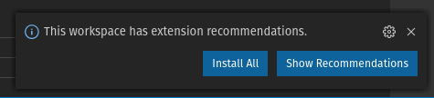
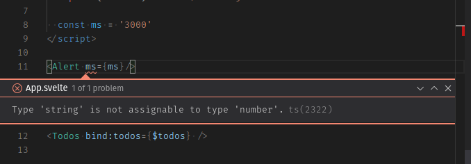
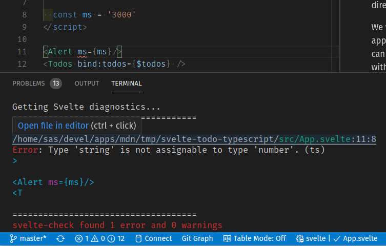
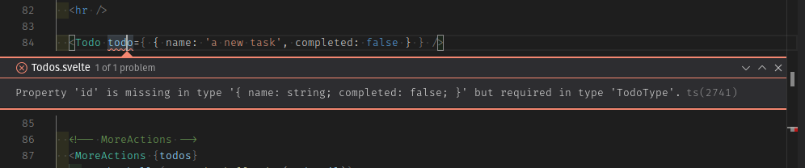
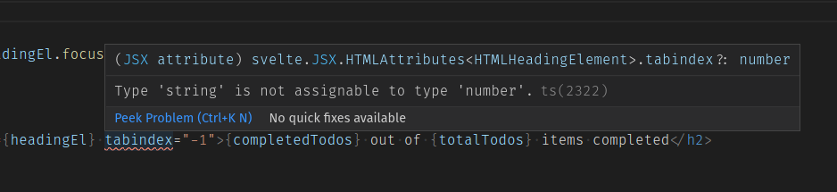
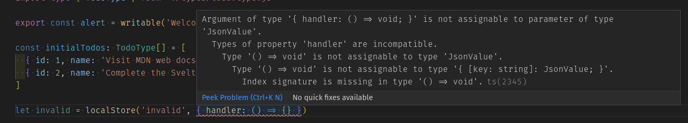
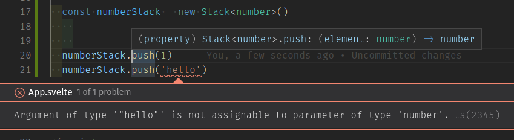
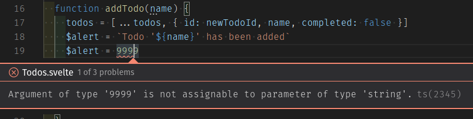
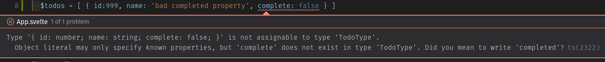

# TypeScript support in Svelte

In the last article we learned about Svelte stores and even implemented our own custom store to persist the app's information to Web Storage. We also had a look at using the `transition` directive to implement animations on DOM elements in Svelte.

We will now learn how to use TypeScript in Svelte applications. First we'll learn what TypeScript is and what benefits it can bring us. Then we'll see how to configure our project to work with TypeScript files. Finally we will go over our app and see what modifications we have to make to fully take advantage of TypeScript features.

Note: Our application is fully functional and porting it to TypeScript is completely optional. There are different opinions about it, and in this chapter we will talk briefly about the pros and cons of using TypeScript. Even if you are not planning to adopt it, this article will be useful for allowing you to learn what it has to offer and help you make your own decision. If you are not interested at all in TypeScript, you can skip to the [next chapter](https://github.com/opensas/mdn-svelte-tutorial/blob/master/08-next-steps/Svelte_next_steps.md), where we will look at different options for deploying our Svelte applications, further resources, and more.

> **Prerequisites**: Familiarity with the core HTML, CSS, and JavaScript languages, knowledge of the terminal/command line.
> 
> **Objective**: Learn how to configure and use TypeScript to develop Svelte application.

## Coding along with us

If you want to get the app's code as it is at the beginning of this article and start coding along, you can clone the GitHub repo (if you haven't already done it) with `git clone https://github.com/opensas/mdn-svelte-tutorial.git` and then `cd mdn-svelte-tutorial/07-typescript-support`. Alternatively, you can directly download the folder's content with `npx degit opensas/mdn-svelte-tutorial/07-typescript-support`. Remember to run `npm install && npm run dev` to start your app in development mode. Unfortunately, [TypeScript support](https://github.com/sveltejs/svelte-repl/issues/130) is not available from the REPL yet.

## TypeScript: optional static typing for JavaScript

[TypeScript](https://www.typescriptlang.org/) is a superset of JavaScript that provides features such as optional static typing, classes, interfaces, and generics. The goal of TypeScript is to help catch mistakes early through its type system and make JavaScript development more efficient. One of the big benefits is enabling IDEs to provide a richer environment for spotting common errors as you type the code.

Best of all, JavaScript code is valid TypeScript code; TypeScript is a superset of JavaScript. You can rename most of your .js files to .ts files and they will just work.

Our TypeScript code will be able to run everywhere JavaScript can run. How is that possible? TypeScript "transpiles" our code to vainilla JavaScript. That means that it parses TypeScript code and produces the equivalent vanilla JavaScript code for browsers to run. 

Note: If you are curious about how TypeScript transpiles our code to JavaScript you can have a look at the [TypeScript Playground](https://www.typescriptlang.org/play/?target=1&e=4#example/hello-world)

First class TypeScript support has been Svelte's most requested feature for quite some time. Thanks to the hard work of the Svelte team, together with many contributors, we have an [official solution](https://svelte.dev/blog/svelte-and-typescript) ready to be put to the test. In this section we'll show you how to setup a Svelte project With TypeScript support to give it a try.

## Why TypeScript?

Recently TypeScript has seen enormous growth. From last year's [GitHub octoverse report](https://octoverse.github.com/) we can see that TypeScript is the [7th most used](https://octoverse.github.com/#top-languages-over-time) and [5th fastest growing](https://octoverse.github.com/#fastest-growing-languages) language used on GitHub. According to [StackOverflow's annual Developer Survey](https://insights.stackoverflow.com/survey/2019#overview) it is the [third most loved language](https://insights.stackoverflow.com/survey/2019#most-loved-dreaded-and-wanted), right behind Rust and Python.

So TypeScript is going through a great phase of adoption. 

TypeScript's main advantages are:

- Early spotted bugs: The compiler checks types at compile time and provides error reporting.
- Readability: Static typing gives the code more structure, making it self-documenting and more readable.
- Rich IDE support: Type information allows code editors and IDEs to offer features like code navigation, autocompletion, and smarter hints.
- Safer refactoring: Types allows IDEs to know more about your code, and assist you while refactoring large portions of your code base.
- Type inference: Enables you to take advantage of many TypeScript features even without declaring variable types.
- Availability of new and future JavaScript features: TypeScript transpiles many recent [ES6 features](http://es6-features.org/) to plain old-school JavaScript, allowing you to use them even on user-agents that don't support them natively yet.

TypeScript also has some disadvantages:

- Not true static typing: Types are only checked at compile time, and they are removed from the generated code.
- Steep learning curve: Even though TypeScript is a superset of JavaScript and not a completely new language, there is a considerable learning curve, especially if you have no experience at all with static languages like Java or C#. 
- More code: You have to write and maintain more code.
- No replacement for automatic tests: Even though types might help you catch several bugs, TypeScript is not a true replacement for a comprehensive suite of automated tests.
- Boiler plate code: Working with types, classes, interfaces, and generics can lead to over-engineered code bases.

There seems to be a broad consensus that TypeScript is particularly well suited for large-scale projects, with many developers working on the same code base. And it is indeed being used by several large-scale projects, like Angular 2, Vue 3, Ionic, Visual Studio Code, Jest and even the Svelte compiler. Nevertheless, some developers prefer to use it even on small projects like the one we are developing.

In the end, it's your decision. In the following sections we hope to give you more evidence to make up your mind about it.

## Creating a Svelte TypeScript project from scratch

You can start a new Svelte TypeScript project using the [normal template](https://github.com/sveltejs/template) and running `node scripts/setupTypeScript.js`. All you have to do is run the following commands (run them somewhere where you are storing your Svelte test projects — it creates a new directory):

```shell
$ npx degit sveltejs/template svelte-typescript-app

$ cd svelte-typescript-app

$ node scripts/setupTypeScript.js
Converted to TypeScript.
```

This creates a starter project that includes TypeScript support, which you can then modify as you wish.

Then you'll have to tell `npm` to download dependencies and start the project in development mode, like we usually do:

```shell
$ npm install

$ npm run dev
```

## Adding TypeScript support to an existing Svelte Project

To add TypeScript support to an existing Svelte project you can follow [these instructions](https://svelte.dev/blog/svelte-and-typescript#Adding_TypeScript_to_an_existing_project). Alternatively, you can download the [setupTypeScript.js](https://github.com/sveltejs/template/blob/master/scripts/setupTypeScript.js) file to a `scripts` folder inside your project's root folder, and then run `node scripts/setupTypeScript.js`. You can even use `degit` to download the script. 

That's what we will do to start porting our application to TypeScript.

> Remember that you can run `npx degit opensas/mdn-svelte-tutorial/07-typescript-support svelte-todo-typescript` to get the complete to-do list application in JavaScript to start porting it to TypeScript.

Go to the root directory of the project and type:

```shell
$ npx degit sveltejs/template/scripts scripts       # download script file to a scripts folder

$ node scripts/setupTypeScript.js                   # run it
Converted to TypeScript.

You will need to re-run your dependency manager to get started.

$ npm install                                       # download new dependencies

$ npm run dev                                       # start the app in development mode
```

These instructions apply to any Svelte project you'd like to convert to TypeScript. Just take into account that the Svelte community is constantly improving Svelte TypeScript support, so you should run `npm update` regularly to take advantage of the latest changes.

Note: if you find any trouble working with TypeScript inside a Svelte application, have a look at this [troubleshooting/FAQ section](https://github.com/sveltejs/language-tools/blob/master/docs/preprocessors/typescript.md#troubleshooting--faq) about TypeScript support. 

As we said before, TypeScript is a superset of JavaScript, so your application will run without modifications. Currently you will be running a regular JavaScript application with TypeScript support enabled, without taking advantage of any of the features that TypeScript provides. You can now start adding types progressively.

Once you have TypeScript configured, you can start using it from a Svelte component by just adding a `<script lang='ts'>` at the beginning of the `script` section. To use it from regular JavaScript files, just change the file extension from `.js` to `.ts`. Don't forget to also update the corresponding `import` statements.

Note: using TypeScript in the HTML markup section [is not supported yet](https://github.com/sveltejs/svelte/issues/4701). You'll have to use JavaScript from the markup, and TypeScript in the `<script lang='ts'>` section.

## Improved developer experience with TypeScript

TypeScript provides code editors and IDEs with lots of information to allow them to deliver a friendlier development experience.

We'll use [Visual Studio Code](https://code.visualstudio.com/) to do a quick test and see how we can get autocompletion hints and type-checking as we're writing components. 

There is work in progress to support TypeScript in Svelte projects in several code editors; the most complete support so far is available in the [Svelte for VS Code](https://marketplace.visualstudio.com/items?itemName=svelte.svelte-vscode) extension, which is developed and maintained by the Svelte team. This extension offers type checking, inspecting, refactoring, intellisense, hover-information, auto-completion, and other features. This kind of developer assistance is another good reason to start using TypeScript in your projects.

> Make sure you are using [Svelte for VS Code](https://marketplace.visualstudio.com/items?itemName=svelte.svelte-vscode) and NOT the old "Svelte" by James Birtles, which has been discontinued. In case you have it installed, you should uninstall it and install the [official Svelte extension](https://marketplace.visualstudio.com/items?itemName=svelte.svelte-vscode) instead.

From the root of your project's folder, type `code .` (the trailing dot tells VS code to open the current folder) to open the code editor. VS Code will tell you that there are recommended extensions to install.



Clicking `Install all` will install [Svelte for VS Code](https://marketplace.visualstudio.com/items?itemName=svelte.svelte-vscode).


We can also see that the [setupTypeScript.js](https://github.com/sveltejs/template/blob/master/scripts/setupTypeScript.js) file made a couple of changes to our project. 

The `main.js` file has been renamed to `main.ts`, which means that VS Code can provide hover-information on our svelte components:

.

We will also get type-checking for free. If we pass an unknown property in the options parameter of the App constructor (for example a typo like `traget` instead of `target`) TypeScript will complain:

.

In the `App.svelte` component, the `setupTypeScript.js` script has added the `lang="ts"` attribute to the `script` section. Moreover, thanks to type inference, in many cases we won't even need to specify types to get code assistance. For example, if you start adding a `ms` property to the `Alert` component call, TypeScript will infer from the default value that the `ms` property should be a number:


And if you pass something that is not a number it will complain about it:



The application template has a `validate` script configured that runs [svelte-check](https://www.npmjs.com/package/svelte-check) against your code. This package allows you to detect errors and warnings normally displayed by a code editor from the command line, which makes it pretty useful for running it in a continuous integration (CI) pipeline. Just run `npm run validate` in your terminal to check for unused CSS, and return A11y hints and TypeScript compile errors.

In this case, if you run `npm run validate` in the VS Code console, you will get the following error :



Even better, when you run it from the VS Code integrated console (you can open it with the Ctrl + ` keyboard shortcut), Cmd/Ctrl + clicking on the file name will take you to the line containing the error.

You can also run the `validate` script in watch mode with `npm run validate -- --watch`. In this case, the script will execute whenever you change any file. If you are using it from the terminal, a good idea is to have this running in a separate terminal of its own so it does not interfere with your other terminal usage.

## Creating a custom type

TypeScript supports [structural typing](https://www.typescriptlang.org/docs/handbook/type-compatibility.html#introduction). Structural typing is a way of relating types based solely on their members, even if you do not explicitly define the type.

We'll define a `TodoType` type to see how TypeScript enforces that anything passed to a component expecting a `TodoType` will be structurally compatible with it. 

Inside the `src` folder create a `types` folder and add a `todo.type.ts` file with the following content:

```TypeScript
export type TodoType = {
  id: number
  name: string
  completed: boolean
}
```

Note: the Svelte `template` uses [svelte-preprocess](https://github.com/sveltejs/svelte-preprocess) 4.0.0 to support TypeScript. From that version onward you have to use `export/import type` syntax to import types and interfaces. Check [this section](https://github.com/sveltejs/language-tools/blob/master/docs/preprocessors/typescript.md#how-do-i-import-interfaces-into-my-svelte-components-i-get-errors-after-transpilation) of the troubleshooting guide for more information.

Now we'll use TodoType from our `Todo.svelte` component. We'll add the `lang="ts"` to our `<script>` tag, and then we'll just import the type and use it to declare the `todo` property.

Replace the `export let todo` line with the following:

```TypeScript
  import type { TodoType } from '../types/todo.type'

  export let todo: TodoType
```

Add the `lang='ts'` to the `<script>` tag of `Todo.svelte` component, otherwise you'll get errors.

> When importing a .ts file you have to omit the extension. Check the [import section](https://www.typescriptlang.org/docs/handbook/modules.html#import) of the TypeScript manual for more information.

Now from `Todos.svelte`, we will instantiate a `Todo` component with a literal object as parameter before the call to the `MoreActions` component, like this:

```html
  <hr />

  <Todo todo={ { name: 'a new task with no id!', completed: false } } />

  <!-- MoreActions -->
  <MoreActions {todos}
```

Add the `lang='ts'` to the `<script>` tag of `Todos.svelte` component, so that it knows to use the type checking we have specified.

We will get the following error in VS Code:



By now you should get an idea about the kind of assistance we can get from TypeScript when building Svelte projects. 

Now we will undo these changes in order to start porting our application to TypeScript, so we won't be bothered with all the `validate` warnings. Remove the flawed todo and the `lang='ts'` attribute from the `Todos.svelte` file. Also remove the `import` of `TodoType` and the `lang='ts'` from `Todo.svelte`. We'll take care of them later on.

## Porting our to-do list app to TypeScript

Now we are ready to start porting our to-list application to take advantage of all the features that TypeScript offers to us.

Let's start the `validate` script in watch mode:

```shell
$ npm run validate -- --watch
> svelte-check "--watch"

Loading svelte-check in workspace: ./svelte-todo-typescript
Getting Svelte diagnostics...
====================================
svelte-check found no errors and no warnings
```

### Alert.svelte

Let's start with our `Alert.svelte` component.

One simple way to start porting a Svelte component is to just add the `<script lang='ts'>` at the top and look for the three-dotted hints in our code editor, like this:


Add lang="ts" into your Alert.svelte component's `<script>` tag, to try this out.

In our case, we'll also see the following warnings in the output of the `validate` script:

```shell
$ npm run validate -- --watch
> svelte-check "--watch"

./svelte-todo-typescript
Getting Svelte diagnostics...
====================================

./svelte-todo-typescript/src/components/Alert.svelte:8:7
Warn: Variable 'visible' implicitly has an 'any' type, but a better type may be inferred from usage. (ts)
  let visible

./svelte-todo-typescript/src/components/Alert.svelte:9:7
Warn: Variable 'timeout' implicitly has an 'any' type, but a better type may be inferred from usage. (ts)
  let timeout

./svelte-todo-typescript/src/components/Alert.svelte:11:28
Warn: Parameter 'message' implicitly has an 'any' type, but a better type may be inferred from usage. (ts)
Change = (message, ms) => {

./svelte-todo-typescript/src/components/Alert.svelte:11:37
Warn: Parameter 'ms' implicitly has an 'any' type, but a better type may be inferred from usage. (ts)
(message, ms) => {
```

We can fix this by specifying the corresponding types, like so:

```typescript
  export let ms = 3000

  let visible: boolean
  let timeout: number

  const onMessageChange = (message: string, ms: number) => {
    clearTimeout(timeout)
    if (!message) {               // hide Alert if message is empty
```

Note: There's no need to specify the `ms` type with `export let ms:number = 3000` because TypeScript is already inferring it from its default value.

Now we'll do the same for the MoreActions.svelte component. After adding the `lang='ts'` attribute, TypeScript will warn us about the `todos` prop and the `t` variable in the call to `todos.filter(t =>...)`

```shell
Warn: Variable 'todos' implicitly has an 'any' type, but a better type may be inferred from usage. (ts)
  export let todos

Warn: Parameter 't' implicitly has an 'any' type, but a better type may be inferred from usage. (ts)
  $: completedTodos = todos.filter(t => t.completed).length
```

We will use the `TodoType` we already defined to tell TypeScript that todos is a `TodoType` array — replace your `export let todos` line with the following :

```typescript
  import type { TodoType } from '../types/todo.type'

  export let todos: TodoType[]
```

Notice that now TypeScript can infer that the `t` variable in `todos.filter(t => t.completed)` is of type `TodoType`. Nevertheless, if we think it makes our code easier to read, we could specify it like this:

```typescript
  $: completedTodos = todos.filter((t: TodoType) => t.completed).length
```

Most of the times TypeScript will be able to correctly infer the reactive variable type, but sometimes you might get an "implicitly has type 'any' error" when working with reactive assignments. In those cases you can declare the typed variable in a different statement, like this:

```typescript
  let completeTodos: number
  $: completedTodos = todos.filter((t: TodoType) => t.completed).length
```

You can't specify the type in the reactive assignment itself. The following statement `$: completedTodos: number = todos.filter[...]` is invalid. For more information check [this article](https://github.com/sveltejs/language-tools/blob/master/docs/preprocessors/typescript.md#how-do-i-type-reactive-assignments--i-get-an-implicitly-has-type-any-error)

### FilterButton.svelte

Now we'll take care of the `FilterButton` component.

Open the `FilterButton.svelte` file

Add the `lang='ts'` attribute to the `script` tag, as usual. You'll notice there are no warnings — TypeScript infers the type of the `filter` variable from the default value. But we know that there are only three valid values for the filter: all, active, and completed. So we can let TypeScript know about them by creating an enum Filter.

Create a `filter.enum.ts` file in the `types` folder.

Give it the following contents:

```typescript
export enum Filter {
  ALL = 'all',
  ACTIVE = 'active',
  COMPLETED = 'completed',
}
```

Now we will use this from the `FilterButton` component. Replace the content of the `FilterButton.svelte` file with the following:

```html
<!-- components/FilterButton.svelte -->
<script lang='ts'>
  import { Filter } from '../types/filter.enum'

  export let filter: Filter = Filter.ALL
</script>

<div class="filters btn-group stack-exception">
  <button class="btn toggle-btn" class:btn__primary={filter === Filter.ALL} aria-pressed={filter === Filter.ALL} on:click={()=> filter = Filter.ALL} >
    <span class="visually-hidden">Show</span>
    <span>All</span>
    <span class="visually-hidden">tasks</span>
  </button>
  <button class="btn toggle-btn" class:btn__primary={filter === Filter.ACTIVE} aria-pressed={filter === Filter.ACTIVE} on:click={()=> filter = Filter.ACTIVE} >
    <span class="visually-hidden">Show</span>
    <span>Active</span>
    <span class="visually-hidden">tasks</span>
  </button>
  <button class="btn toggle-btn" class:btn__primary={filter === Filter.COMPLETED} aria-pressed={filter === Filter.COMPLETED} on:click={()=> filter = Filter.COMPLETED} >
    <span class="visually-hidden">Show</span>
    <span>Completed</span>
    <span class="visually-hidden">tasks</span>
  </button>
</div>
```

We are just importing the `Filter` enum, and using it instead of the string values we used previously.

### Todos.svelte

We will also use the `Filter` enum in the `Todos.svelte` file.

First add the `lang='ts'` attribute, as before.

 Next, import the `Filter` enum — add the following import statement below your existing ones:

```typescript
  import { Filter } from '../types/filter.enum'
```

Now we will use it whenever we reference the current filter. Replace your two filter-related blocks with the following:

```typescript
  let filter: Filter = Filter.ALL
  const filterTodos = (filter: Filter, todos) => 
    filter === Filter.ACTIVE ? todos.filter(t => !t.completed) :
    filter === Filter.COMPLETED ? todos.filter(t => t.completed) : 
    todos

  $: {
    if (filter === Filter.ALL)               $alert = 'Browsing all todos'
    else if (filter === Filter.ACTIVE)       $alert = 'Browsing active todos'
    else if (filter === Filter.COMPLETED)    $alert = 'Browsing completed todos'
  }
```

If you run `npm run validate` you'll see a bunch of warnings from `Todos.svelte`. Let's fix them.

Start by importing the `TodoType` and telling TypeScript that our `todos` variable is an array of `TodoType`. Replace `export let todos = []` with the following two lines:

```typescript
  import type { TodoType } from '../types/todo.type'

  export let todos: TodoType[] = []
```

Next we'll specify all the missing types. The variable `todosStatus`, which we used to programmatically access the methods exposed by the `TodosStatus` component, is of type `TodosStatus`. And each todo will be of type `TodoType`.

Update your `script` section to look like this:

```typescript
<!-- components/Todos.svelte -->
<script lang='ts'>
  import FilterButton from './FilterButton.svelte'
  import Todo from './Todo.svelte'
  import MoreActions from './MoreActions.svelte'
  import NewTodo from './NewTodo.svelte'
  import TodosStatus from './TodosStatus.svelte'
  import { alert } from '../stores'

  import { Filter } from '../types/filter.enum'

  import type { TodoType } from '../types/todo.type'

  export let todos: TodoType[] = []

  let todosStatus: TodosStatus                   // reference to TodosStatus instance

  $: newTodoId = todos.length > 0 ? Math.max(...todos.map(t => t.id)) + 1 : 1

  function addTodo(name: string) {
    todos = [...todos, { id: newTodoId, name, completed: false }]
    $alert = `Todo '${name}' has been added`
  }

  function removeTodo(todo: TodoType) {
    todos = todos.filter(t => t.id !== todo.id)
    todosStatus.focus()             // give focus to status heading
    $alert = `Todo '${todo.name}' has been deleted`
  }

  function updateTodo(todo: TodoType) {
    const i = todos.findIndex(t => t.id === todo.id)
    if (todos[i].name !== todo.name)            $alert = `todo '${todos[i].name}' has been renamed to '${todo.name}'`
    if (todos[i].completed !== todo.completed)  $alert = `todo '${todos[i].name}' marked as ${todo.completed ? 'completed' : 'active'}`
    todos[i] = { ...todos[i], ...todo }
  }

  let filter: Filter = Filter.ALL
  const filterTodos = (filter: Filter, todos: TodoType[]) => 
    filter === Filter.ACTIVE ? todos.filter(t => !t.completed) :
    filter === Filter.COMPLETED ? todos.filter(t => t.completed) : 
    todos

  $: {
    if (filter === Filter.ALL)               $alert = 'Browsing all todos'
    else if (filter === Filter.ACTIVE)       $alert = 'Browsing active todos'
    else if (filter === Filter.COMPLETED)    $alert = 'Browsing completed todos'
  }

  const checkAllTodos = (completed: boolean) => {
    todos = todos.map(t => ({...t, completed}))
    $alert = `${completed ? 'Checked' : 'Unchecked'} ${todos.length} todos`
  }
  const removeCompletedTodos = () => {
    $alert = `Removed ${todos.filter(t => t.completed).length} todos`
    todos = todos.filter(t => !t.completed)
  }
</script>
```

### Todo.svelte and TodosStatus.svelte

We are encountering another issue when we are passing todos to the `TodosStatus.svelte` and `Todo.svelte` components:

```shell
./src/components/Todos.svelte:70:39
Error: Type 'TodoType[]' is not assignable to type 'undefined'. (ts)
  <TodosStatus bind:this={todosStatus} {todos} />

./src/components/Todos.svelte:76:12
Error: Type 'TodoType' is not assignable to type 'undefined'. (ts)
     <Todo {todo}
```

This is because the `todos` prop in the `TodosStatus` component has no default value, so TypeScript inferred it to be of type `undefined`, which is not compatible with an array of `TodoType`. The same thing is happening with our `Todo` component.

Let's fix it.

Open the file `TodosStatus.svelte` and add the `lang='ts'` attribute.

Then import the `TodoType` and declare the `todos` prop as an array of `TodoType`. Replace the first line of the `<script>` section with the following:

```html
<script lang='ts'>
  import type { TodoType } from '../types/todo.type'

  export let todos: TodoType[]
```

We will also specify the `headingEl`, which we used to bind to the `heading` tag, as an `HTMLElement`. Update the `let headingEl` line with the following:

```typescript
  let headingEl: HTMLElement
```

Finally, you'll notice that vscode is reporting an error in the `h2` tag when we set the `tabindex` attribute. That's because TypeScript is type-checking the `h2` tag and expects tabindex to be of type number.



To fix it we replace `tabindex="-1"` with `tabindex={-1}`, like this:

```html
<h2 id="list-heading" bind:this={headingEl} tabindex={-1}>{completedTodos} out of {totalTodos} items completed</h2>
```

This way TypeScript can prevent us from incorrectly assigning it to a string variable.

### NewTodo.svelte

Next we will take care of `NewTodo.svelte`.

As usual, add the `lang='ts'` attribute.

The warning will indicate that we just have to specify a type for the `nameEl` variable. Set its type to `HTMLElement` like this:

```typescript
  let nameEl: HTMLElement     // reference to the name input DOM node
```

Last for this file, we need to specify the correct type for our `autofocus` variable; update its definition like this:

```
export let autofocus: boolean = false
```

### Todo.svelte

Now the only warnings that `npm run validate` emits are triggered by calling the `Todo.svelte` component; let's fix them.

Open the `Todo.svelte` file, add the `lang='ts'` attribute.

Import the `TodoType`, and set the type of the todo prop. Replace the `export let todo` line with the following:

```typescript
  import type { TodoType } from '../types/todo.type'

  export let todo: TodoType
```

The first warning we get is TypeScript telling us to define the type of the `update()` function's `updatedTodo` variable. This can be a little tricky because `updatedTodo` contains only the attributes of the todo that have been updated. That means it's not a complete todo — it only has a subset of a todo's properties.

For these kinds of cases, TypeScript provides several [utility types](https://www.typescriptlang.org/docs/handbook/utility-types.html) to make it easier to apply these common transformations. What we need right now is the [`Partial<T>`](https://www.typescriptlang.org/docs/handbook/utility-types.html#partialt) utility, which allows us to represent all subsets of a given type. The partial utility returns a new type based on the type T, where every property of T is optional.

We'll use it in the `update()` function — update yours like so:

```typescript
  function update(updatedTodo: Partial<TodoType>) {
    todo = { ...todo, ...updatedTodo }    // applies modifications to todo
    dispatch('update', todo)              // emit update event
  }
```

With this we are telling TypeScript that the `updatedTodo` variable will hold a subset of the `TodoType` properties.

Now `svelte-check` tells us that we have to define the type of our action function parameters:

```
./07-next-steps/src/components/Todo.svelte:45:24
Warn: Parameter 'node' implicitly has an 'any' type, but a better type may be inferred from usage. (ts)
  const focusOnInit = (node) => node && typeof node.focus === 'function' && node.focus()

./07-next-steps/src/components/Todo.svelte:47:28
Warn: Parameter 'node' implicitly has an 'any' type, but a better type may be inferred from usage. (ts)
  const focusEditButton = (node) => editButtonPressed && node.focus()
```

We just have to define the `node` variable to be of `HTMLElement` type. In the two lines indicated above, replace the first instance of `node` with `node: HTMLElement`.

### actions.js

Next we'll take care of the `actions.js` file. Just rename it to `actions.ts` and add the type of the `node` parameter. It should end up looking like this:

```typescript
// actions.ts
export function selectOnFocus(node: HTMLInputElement) {
  if (node && typeof node.select === 'function' ) {               // make sure node is defined and has a select() method
    const onFocus = () => node.select()                           // event handler
    node.addEventListener('focus', onFocus)                       // when node gets focus call onFocus()
    return {
      destroy: () => node.removeEventListener('focus', onFocus)   // this will be executed when the node is removed from the DOM
    }
  }
}
```

Now update `Todo.svelte` and `NewTodo.svelte` where we import the `actions` file. Remember that imports in TypeScript don't have the file extensions. It should end up, like this:

```typescript
  import { selectOnFocus } from '../actions'
```

## Migrating the stores to TypeScript

Now we have to migrate the `stores.js` and `localStore.js` files to TypeScript.

Tip: the script `npm run validate`, which uses the [svelte-check](https://github.com/sveltejs/language-tools/tree/master/packages/svelte-check) tool, will only check our application's `.svelte` files. If you want to also check the `.ts` files you can run `npm run validate && npx tsc --noemit`, which tells the TypeScript compiler to check for errors without generating the `.js` output files. You could even add a script to your package.json file that runs that command.

We'll start with `stores.js`.

Rename the file to `stores.ts`.

Set the type of our initialTodos array to `TodoType[]`. This is how the contents will end up:

```typescript
// stores.ts
import { writable } from 'svelte/store'
import { localStore } from './localStore.js'
import type { TodoType } from './types/todo.type'

export const alert = writable('Welcome to the To-Do list app!')

const initialTodos: TodoType[] = [
  { id: 1, name: 'Visit MDN web docs', completed: true },
  { id: 2, name: 'Complete the Svelte Tutorial', completed: false },
]

export const todos = localStore('mdn-svelte-todo', initialTodos)
```

Remember to update the import statement in `App.svelte`, `Alert.svelte` and `Todos.svelte`. Just remove the `.js` extension, like this:

```typescript
  import { todos } from '../stores'
```

Now onto `localStore.js`.

Start by renaming the file to `localStore.ts`.

Update the import statement in `stores.ts`, like so:

```typescript
import { localStore } from './localStore'
```

TypeScript is telling us to specify the type of the `key`, `initial` and `value` variables. The first one is easy — the key of our local web storage should be a string.

But `initial` and `value` should be any object that could be converted to a valid JSON string with the [`JSON.stringify`](https://developer.mozilla.org/en-US/docs/Web/JavaScript/Reference/Global_Objects/JSON/stringify) method. So it is in fact any JavaScript object with a couple limitations, for example `undefined`, `functions`, and `symbols` are not valid JSON values.

So we'll create the type `JsonValue` to specify those kind of objects.

Create the file `json.type.ts` in the `types` folder.

Give it the following content:

```typescript
export type JsonValue = string | number | boolean | null | JsonValue[] | { [key: string]: JsonValue }
```

The `|` operator lets us declare variables that could store values of two or more types. A `JsonValue` could be a string, a number, a boolean and so on. In this case we are also making use of [Recursive types](https://www.typescriptlang.org/docs/handbook/release-notes/typescript-3-7.html#more-recursive-type-aliases), to specify that a `JsonValue` can have an array of `JsonValue`, and also an object with properties of type `JsonValue`.

We will import our `JsonValue` type and use it accordingly. Our `localStore.ts` file will end up like this — update it now:

```typescript
// localStore.ts
import { writable } from 'svelte/store'

import type { JsonValue } from './types/json.type'

export const localStore = (key: string, initial: JsonValue) => {          // receives the key of the local storage and an initial value

  const toString = (value: JsonValue) => JSON.stringify(value, null, 2)   // helper function
  const toObj = JSON.parse                                                // helper function

  if (localStorage.getItem(key) === null) {                               // item not present in local storage
    localStorage.setItem(key, toString(initial))                          // initialize local storage with initial value
  }

  const saved = toObj(localStorage.getItem(key))                          // convert to object

  const { subscribe, set, update } = writable(saved)                      // create the underlying writable store

  return {
    subscribe,
    set: (value: JsonValue) => {
      localStorage.setItem(key, toString(value))                          // save also to local storage as a string
      return set(value)
    },
    update
  }
}
```

Now if we try to create a `localStore` with something that cannot be converted to JSON with `JSON.stringify()`, for example an object with a function as a property, VS Code will complain about it:



And best of all, it will even work with the [$store auto-subscription syntax](https://svelte.dev/docs#4_Prefix_stores_with_$_to_access_their_values). If we try to save an invalid value to our todos store using the $store syntax, like this:

```html
<!-- App.svelte -->
<script lang="ts">
  import Todos from './components/Todos.svelte'
  import Alert from './components/Alert.svelte'

  import { todos } from './stores'

  // this is invalid, the content cannot be converted to JSON using JSON.stringify
  $todos = { handler: () => {} }

</script>
```

The `validate` script will report the following error:

```shell
$ npm run validate 

Getting Svelte diagnostics...
====================================

./svelte-todo-typescript/src/App.svelte:8:12
Error: Argument of type '{ handler: () => void; }' is not assignable to parameter of type 'JsonValue'.
  Types of property 'handler' are incompatible.
    Type '() => void' is not assignable to type 'JsonValue'.
      Type '() => void' is not assignable to type '{ [key: string]: JsonValue; }'.
        Index signature is missing in type '() => void'. (ts)
 $todos = { handler: () => {} }
```

This is another example of how specifying types can make our code more robust, and help us catch more bugs before they get into production.

## Bulletproofing our stores with Generics

Our stores have already been ported to TypeScript but we can do better. We don't want to store any kind of value, we know that the `alert` store should contain string messages, and the `todos` store should contain an array of `TodoType`. We can let TypeScript enforce it. In order to do that we'll have to talk a little bit about [TypeScript Generics](https://www.typescriptlang.org/docs/handbook/generics.html).

### Understanding TypeScript generics

Generics allows to create reusable code components that work with a variety of types instead of a single type. They can be applied to interfaces, classes and functions. Generic types are passed as parameters using a special syntax: they are specified between angle-brackets, and by convention are denoted with and upper-cased single char letter. Generic types allows us to capture the types provided by the user to be used latter.

Let's see a quick example. We'll implement a simple `Stack` class, which will let us `push` and `pop` elements, like this:

```typescript
export class Stack {
  private elements = []

  push = (element) => this.elements.push(element)

  pop() {
    if (this.elements.length === 0) throw new Error('The stack is empty!')
    return this.elements.pop()
  }
}
```

In this case `elements` is an array of type `any`, and accordingly the `push()` and `pop()` methods receives and returns a variable of type `any` respectively. So it's perfectly valid to do something like the following:

```typescript
  const anyStack = new Stack()

  anyStack.push(1)
  anyStack.push('hello')
```

But what if we wanted to have a `Stack` that would only work with `strings`? We could do the following:

```typescript
export class StringStack {
  private elements: string[] = []

  push = (element: string) => this.elements.push(element)

  pop(): string {
    if (this.elements.length === 0) throw new Error('The stack is empty!')
    return this.elements.pop()
  }
}
```

That would work. But if we wanted to work with numbers we would have to duplicate our code and create a `NumberStack` class. And how could we handle a stack of types we don't know yet, and that should be defined by the consumer? 

To solve all these problems we can use generics.

This is our `Stack` class using generics:

```typescript
export class Stack<T> {
  private elements: T[] = []

  push = (element: T): number => this.elements.push(element)

  pop(): T {
    if (this.elements.length === 0) throw new Error('The stack is empty!')
    return this.elements.pop()
  }
}
```

We define a generic type `T` and then we use it like we would normally use a type. Now `elements` is an array of type `T`, and `push()` and `pop()` also receives and returns a variable of type `T`.

This is how we would use our generic `Stack`:

```typescript
  const numberStack = new Stack<number>()
  numberStack.push(1)
```

Now TypeScript knows that our stack can only accepts numbers, and will issue an error if we try to push anything else:



TypeScript can also infer generic types by its usage. Generics also support default values and [constraints](https://www.typescriptlang.org/docs/handbook/generics.html#generic-constraints).

Generics is a powerful feature that allows our code to abstract away from the specific types being used, making it more reusable and generic without giving up on type-safety. To learn more about it check the [TypeScript Introduction to Generics](https://www.typescriptlang.org/docs/handbook/generics.html).

## Using Svelte stores with Generics

Svelte stores support generics out of the box. And, because of generic type inference we can take advantage of it without even touching our code.

If you open the file `Todos.svelte` and assign a number to our `$alert` store, you'll get the following error:



That's because when we defined our `alert` store in the `stores.ts` file with:

```typescript
export const alert = writable('Welcome to the To-Do list app!')
```

TypeScript inferred the generic type to be of type `string`. If we want to be explicit about we can do like this:

```typescript
export const alert = writable<string>('Welcome to the To-Do list app!')
```

Now we have to make our `localStore` store support generics. Remember that we defined the `JsonValue` type to prevent the usage of our `localStore` store with values that cannot be persisted using `JSON.stringify()`. Now we want the consumers of `localStore` to be able to specify the type of data to persist, but instead of working with any type they should comply with the `JsonValue` type. We'll specify that with a [Generic constraint](https://www.typescriptlang.org/docs/handbook/generics.html#generic-constraints), like this:

```typescript
export const localStore = <T extends JsonValue>(key: string, initial: T)
```

We define a generic type `T` and we specify that it must be compatible with the `JsonValue` type. Then we'll use the the `T` type appropriately. Our `localStore.ts` file will end up like this:

```typescript
// localStore.ts
import { writable } from 'svelte/store'

import type { JsonValue } from './types/json.type'

export const localStore = <T extends JsonValue>(key: string, initial: T) => {          // receives the key of the local storage and an initial value

  const toString = (value: T) => JSON.stringify(value, null, 2)           // helper function
  const toObj = JSON.parse                                                // helper function

  if (localStorage.getItem(key) === null) {                               // item not present in local storage
    localStorage.setItem(key, toString(initial))                          // initialize local storage with initial value
  }

  const saved = toObj(localStorage.getItem(key))                          // convert to object

  const { subscribe, set, update } = writable<T>(saved)                   // create the underlying writable store

  return {
    subscribe,
    set: (value: T) => {
      localStorage.setItem(key, toString(value))                          // save also to local storage as a string
      return set(value)
    },
    update
  }
}
```

And thanks to generic type inference, TypeScript already knows that our `$todos` store should contain an array of `TodoType`:



Once again, if we want to be explicit about it, we can do so in the `stores.ts` file:

```typescript
const initialTodos: TodoType[] = [
  { id: 1, name: 'Visit MDN web docs', completed: true },
  { id: 2, name: 'Complete the Svelte Tutorial', completed: false },
]

export const todos = localStore<TodoType[]>('mdn-svelte-todo', initialTodos)
```

And that's it. With this last change we converted our whole application to TypeScript.

## Coding along with us

If you want to see how the app's code should look like by now you can clone the github repo (if you haven't already done it) with `git clone https://github.com/opensas/mdn-svelte-tutorial.git` and then `cd mdn-svelte-tutorial/08-next-steps`, or you may directly download the folder's content with `npx degit opensas/mdn-svelte-tutorial/08-next-steps`. Remember to run `npm install && npm run dev` to start you app in development mode. Unfortunately, [TypeScript support](https://github.com/sveltejs/svelte-repl/issues/130) is not available from the REPL yet.

## Summary

In this article we took our to-do list application and ported it to TypeScript.

We first learnt about TypeScript and what advantages it can bring us. Then we saw how to create a new Svelte project with TypeScript support. We also saw how to convert an existing Svelte project to use TypeScript — our to-do list app.

We saw how to work with [Visual Studio Code](https://code.visualstudio.com/) and the [Svelte extension](https://marketplace.visualstudio.com/items?itemName=svelte.svelte-vscode) to get features like type checking and auto-completion. We also used the `svelte-check` tool to inspect TypeScript issues from the command line.

In the next article we will learn how to compile and deploy our app to production. We will also see which resources are available on line to keep learning Svelte.